# 🏥 Doctalk-AI – AI-Powered Teleclinic Platform  
*MERN Stack (MongoDB, Express.js, React.js, Node.js) with EJS | 2025*


---

## 📖 Overview
Doctalk-AI is a **full-stack AI-powered teleclinic platform** that connects **patients, doctors, and admins** in a seamless digital healthcare ecosystem.  
It combines **AI-driven diagnosis, secure video consultations, UPI-based payments, and health record management** into a single platform.

---

## 🚀 Tech Stack


---

## ✨ Features

- 🤖 **AI Symptom-Analysis Chatbot**  
  Generates structured JSON outputs → condition, severity, recommendations.

- 🎥 **Video Consultations**  
  Secure integration with **Google Meet / Zoom** and appointment scheduling.

- 💳 **UPI-Based Payments**  
  Linked directly to doctor availability and patient bookings.

- 📑 **Medical Record Management**  
  Upload/download prescriptions, maintain health history, and lab test requests.

- 🔐 **Role-Based Authentication**  
  Secure login with JWT → roles: Patient, Doctor, Admin.

- 📊 **Admin Dashboard**  
  Manage doctors, patients, payments, appointments, chat logs, lab requests.

---

## 🖼️ Screenshots

### 🧑 Patient Interface
| 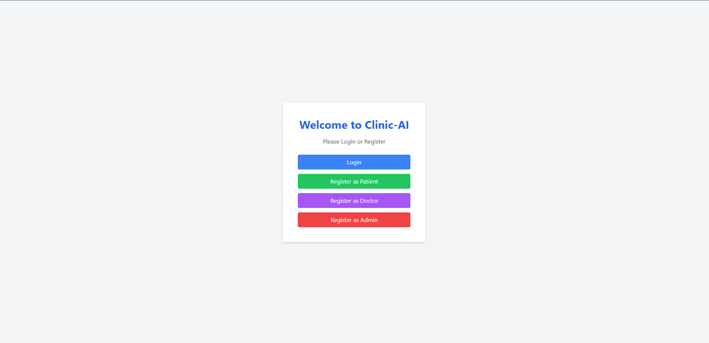 | 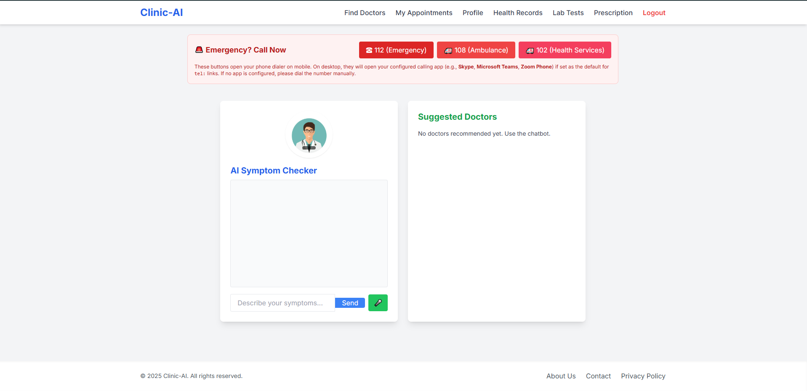 | 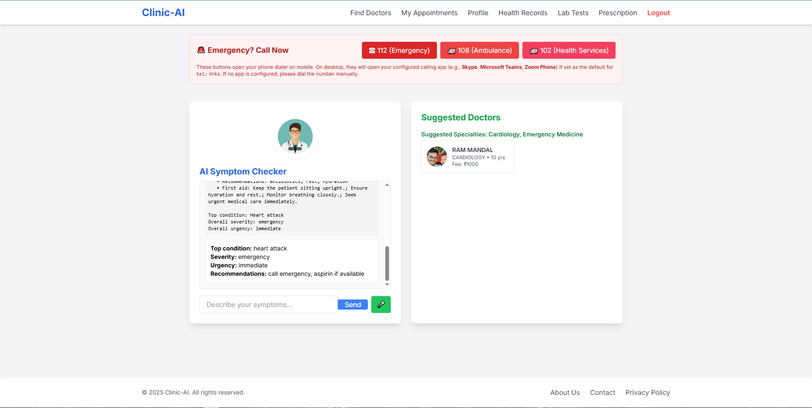 |
|-------------------------------|-------------------------------|-------------------------------|
| 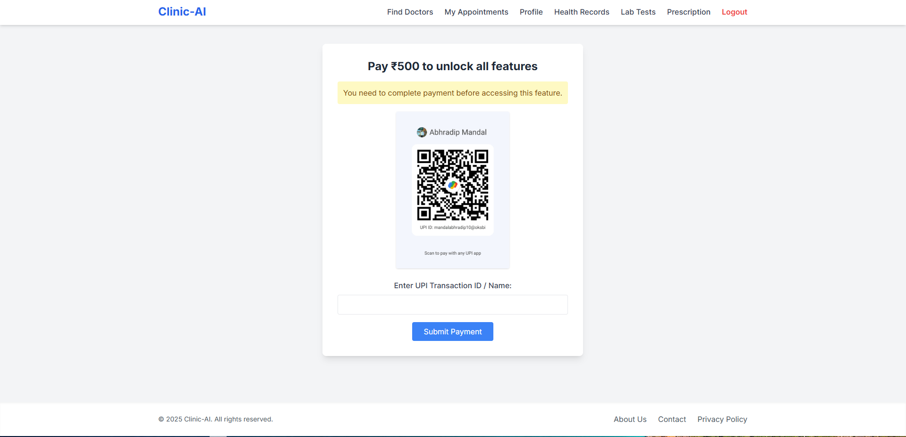 | 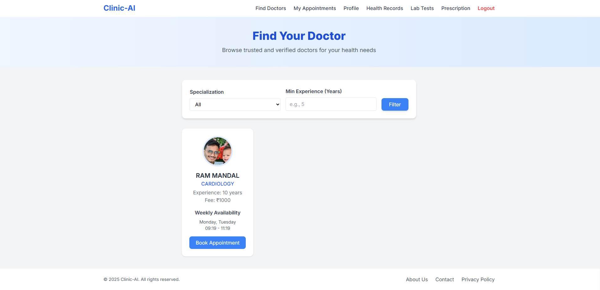 | 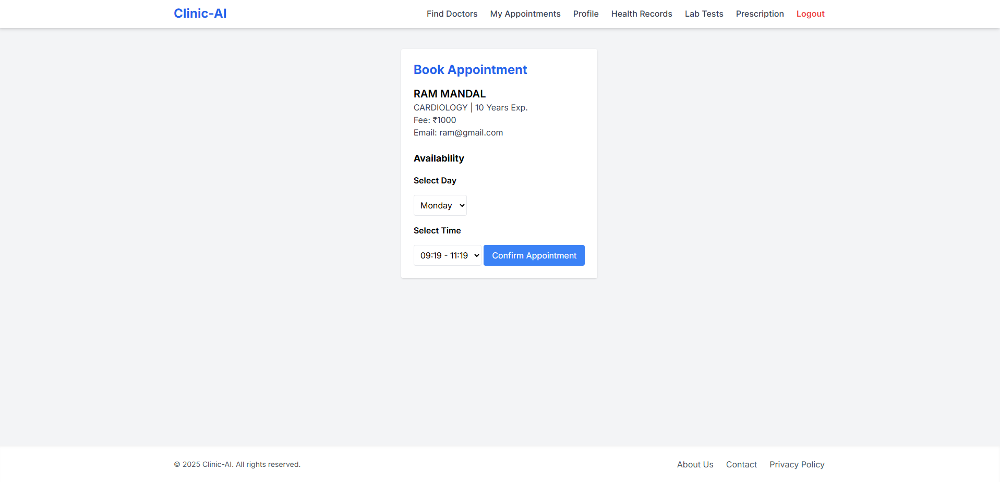 |
|  | 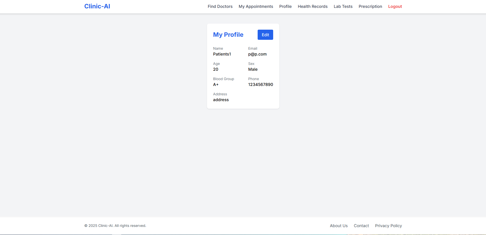 | 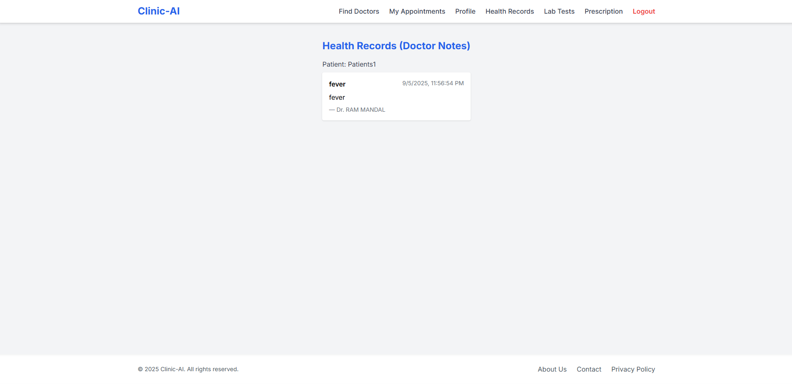 |
|  | 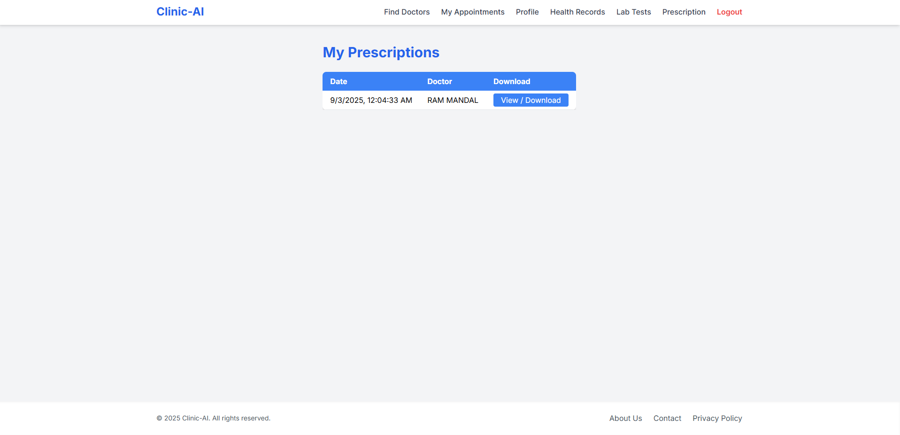 | |

---

### 🧑‍⚕️ Doctor Interface
| 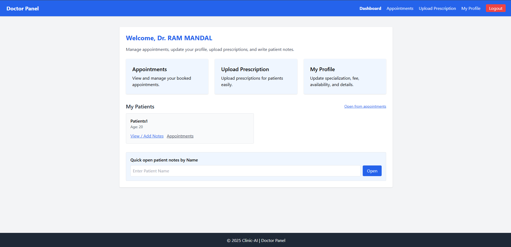 | 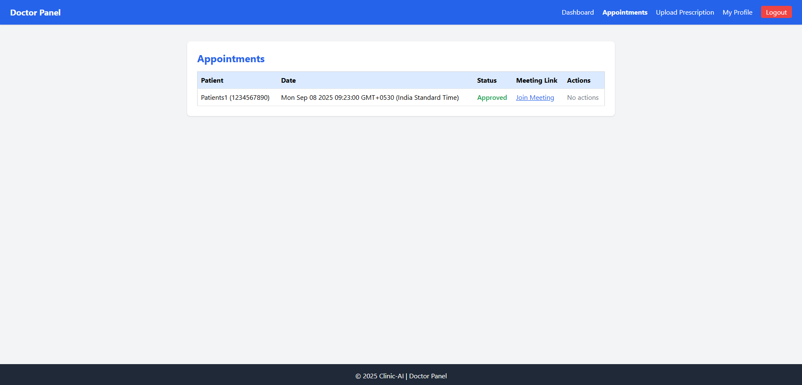 | 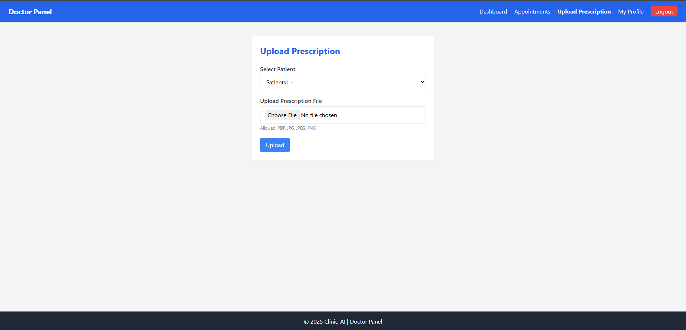 |
|--------------------------------|--------------------------------|--------------------------------|
| 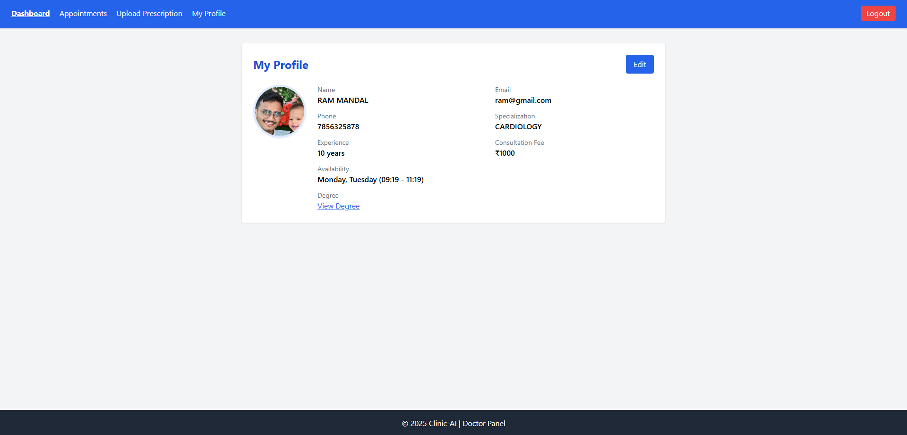 | |

---

### 🛡️ Admin Interface
| 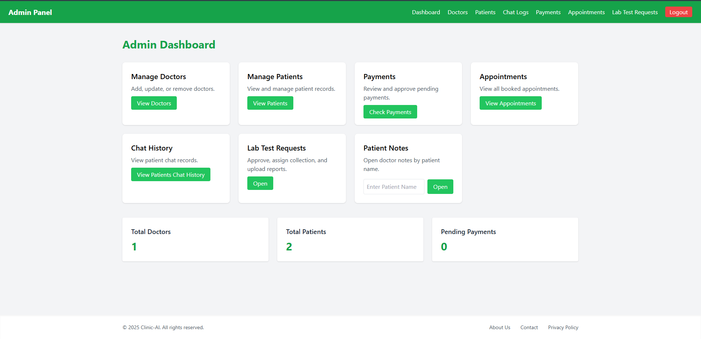 | 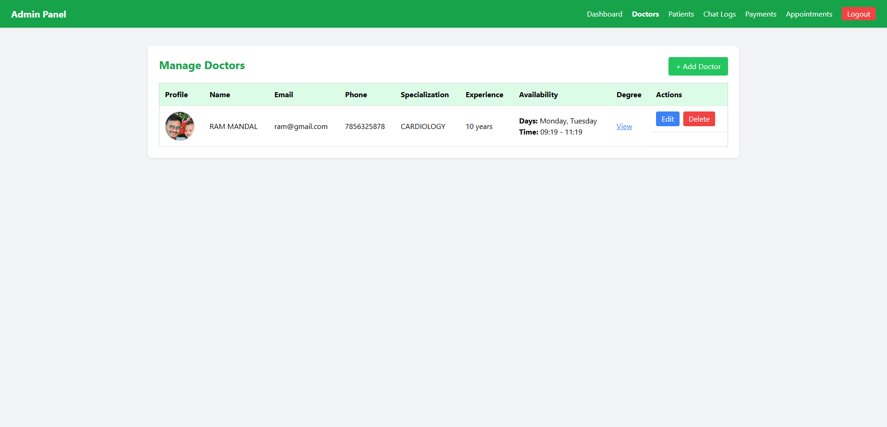 | 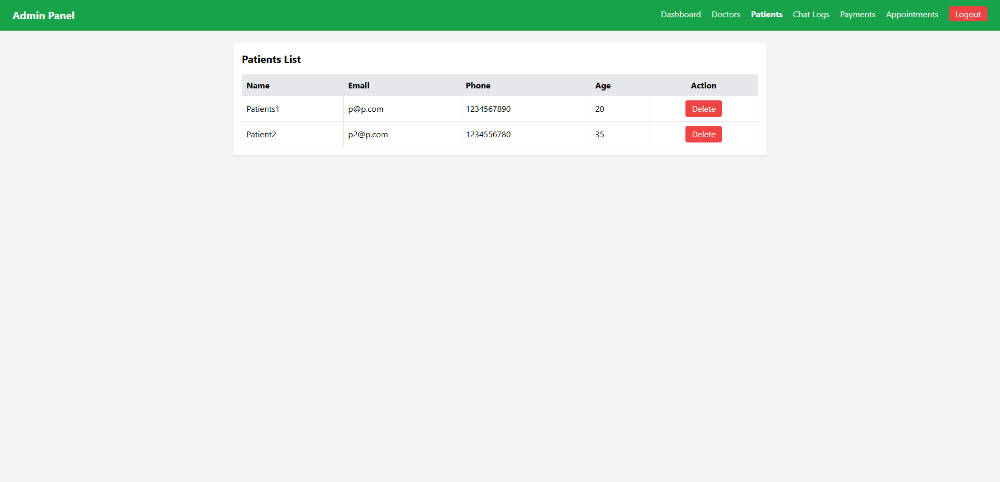 |
|--------------------------------|--------------------------------|--------------------------------|
| 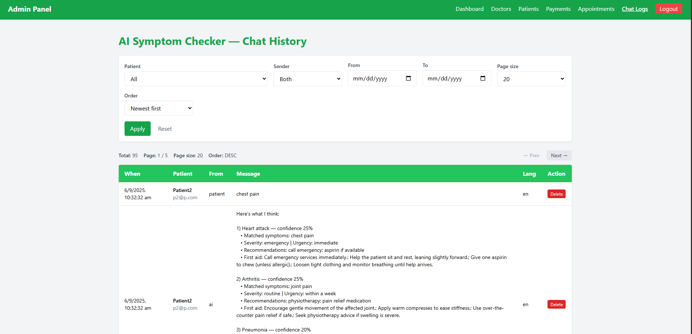 | 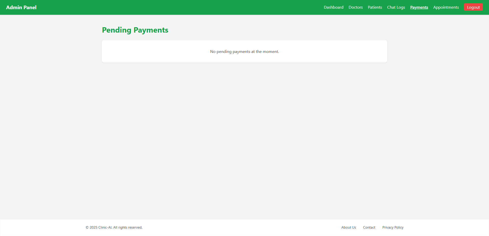 | 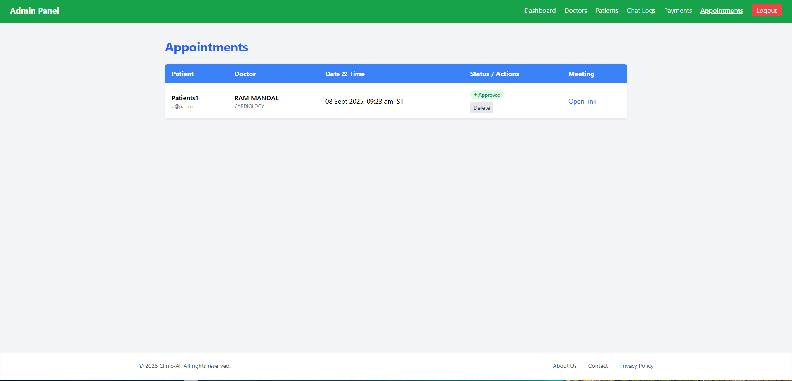 |
| 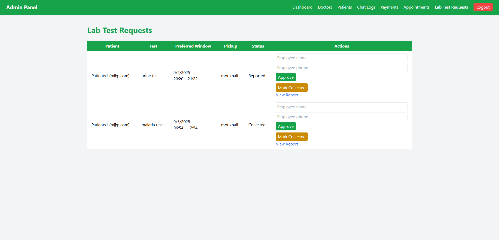 | 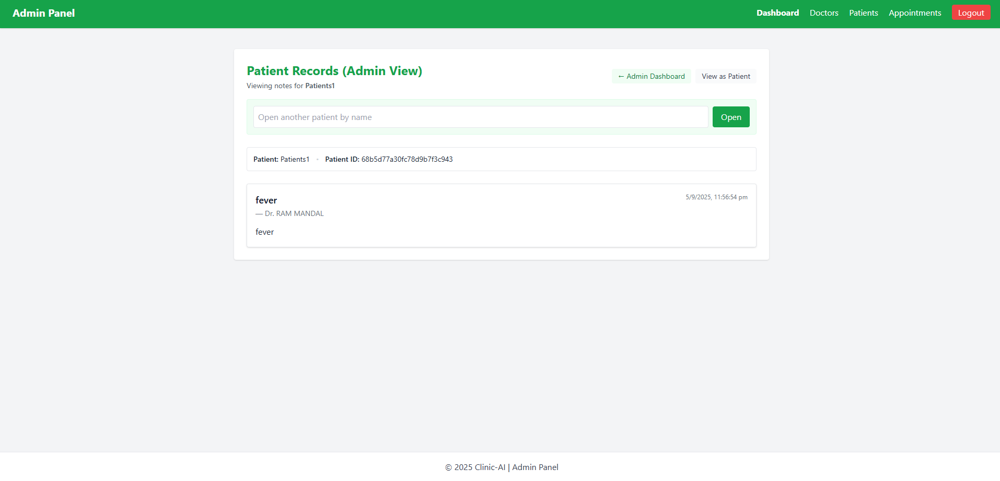 | |

---
## 🔮 Future Enhancements
- Add AI voice assistant for symptom analysis.  
- Enable multilingual support (Hindi, Bengali, English).  
- Add push notifications for appointment reminders.  
- Expand AI model for advanced disease predictions.

---

## ⚡ Installation & Setup

```bash
# Clone repository
git clone https://github.com/abhradip001/doctalk-ai.git
cd doctalk-ai

# Install dependencies for backend
cd backend
npm install

# Install dependencies for frontend
cd ../frontend
npm install

# Create a .env file in backend with:
MONGO_URI=your_mongodb_connection_string
JWT_SECRET=your_secret_key
PAYMENT_GATEWAY_KEY=upi_key_here

# Run backend
cd backend
npm start

# Run frontend
cd ../frontend
npm start


## 📜 License
This project is licensed under the terms of the **MIT License**.  
See the [LICENSE](./LICENSE) file for details.

## 🙌 Acknowledgements
- [Contributor Covenant](https://www.contributor-covenant.org/) for the Code of Conduct  
- [Shields.io](https://shields.io) for the badges  
- [MongoDB, Express.js, React, Node.js, EJS, TailwindCSS] for powering the stack  

## 📬 Contact
- **Abhradip Mandal**  
- 📧 Email: mandalabhradip5@gmail.com  
- 💼 [LinkedIn](https://www.linkedin.com/in/abhradipmandal)  
- 🐙 [GitHub](https://github.com/abhradip001)
